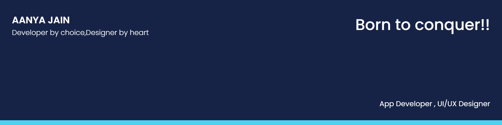

 

 🌱 I'm currently learning React Native for building apps  
 👯 I'm looking to collaborate with other content creators and developers 
 💼 I’m pursuing a Bachelor's degree in Compuer Science Engineering from VIT,Chennai; 
 💬 Ask me about anything, I am happy to help; 
 📫 Please email via jainaanya2000@gmail.com or aanya.jain2018@vitstudent.ac.in to reach me. 

 2021 Goals-Contribute more to Open-Source Projects  

## 🤝 Connect

 &nbsp;&nbsp;&nbsp;
 &nbsp;&nbsp;&nbsp;

 

*Languages and Tools:*  
<code></code>
<code></code>
<code></code>
<code></code>
<code></code>
 <code></code>

